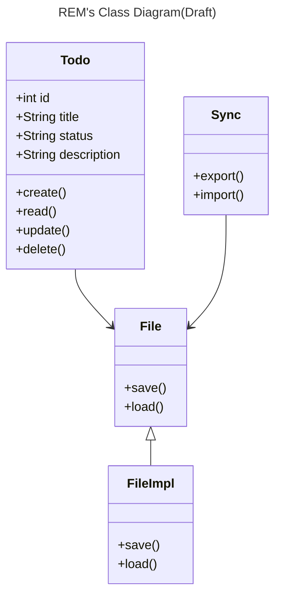

# Requirements
- UIからTODOタスク（以下タスクと呼ぶ）の作成・更新・削除ができること
- タスクのデータ管理はオフラインかつローカル環境で完結すること
- それぞれのタスクがもつ情報は以下
  - タスクのタイトル
  - ステータス
    - TODO
    - DOING
    - DONE
    - PENDING
  - タスクの詳細
- それぞれのタスクは一つの.mdファイルと紐づけられ、タイトル・ステータス・詳細はmdファイルに記載されます。
  - タイトル：mdファイルのファイル名
  - ステータス：mdファイルが配置されているディレクトリのディレクトリ名で判断する。例えば、ステータスがTODOのタスクはtodo/ディレクトリに保存される。ステータスが変更されると、該当するmdファイルは然るべきステータスのディレクトリに移動される。
  - 詳細：mdファイルの1行目以降に記載（複数行になることを想定している）
- タスクとmdファイルは一対一で紐づくこと

# Class diagram

